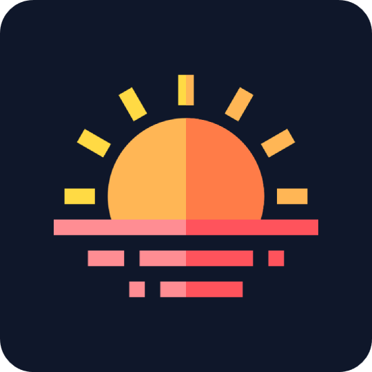

  

<h1 align="center">DayLang</h1>

  
  
  

  Daily vocabulary builder for language learners.

## Features

- **Speak with confidence**
- Daily learning with spaced repetition
- Streaks, XP, and leaderboards like [Duolingo](https://www.duolingo.com)
- Full configuration like [Anki](https://apps.ankiweb.net)
- Pre-built courses or create your own
- Paid app, or selfhost

## Contributing

See [`CONTRIBUTING.md`](./CONTRIBUTING.md).

## Project

- See [milestones](https://github.com/8thpark/daylang/milestones) for the roadmap
- See [changelog](https://wip.co/projects/daylang) for more unstructured updates
